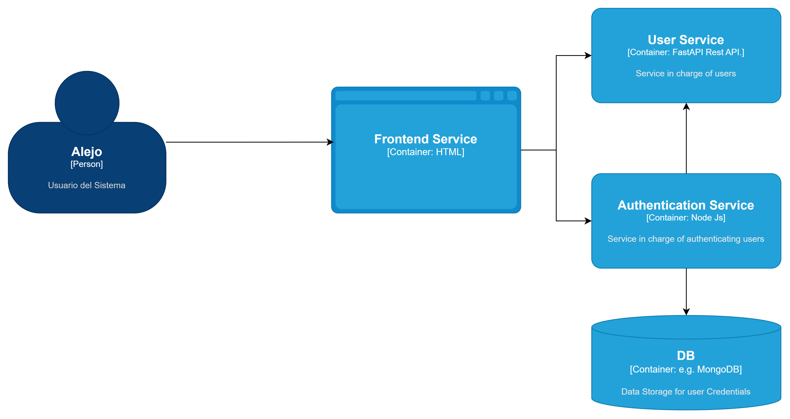

# Clase Arquitectura de Software

El objetivo de esta demostracion es entender mediante un ejemplo completo, como una arquitectura de microservicios interactua entre si para poder ejecutar una peticion del usuario.

El repositorio consta de tres servicios principales:

1. Un frontend.
2. Un servicio de autenticación.
3. Un servicio de usuarios.

Mediante una pantalla de login, se demuestra la interacion entre los diferentes microservicios utilizando como protocolo HTTP.

## Inicializacion del sistema

### Docker

Para comenzar la aplicacion utilizando docker-compose.

```bash
docker-compose up [-d] [--build]
```

Para terminar la aplicacion. (-v para borrar los volumenes)

```bash
docker-compose down [-v]
```

### Local

Para comenzar la aplicacion de manera local se tienen que tener en cuenta las siguientes caracteristicas.

El `authentication-service` es una api realizada en node por lo que debe tener instalado al menos node js v+20.
Mirar el archivo `.env.example` y crear un `.env`  con los valores necesario de las variables de entorno.

Una vez realizado ejecutar desde `authentication-service` como root el comando.

```bash
npm install # si es la primera vez

node ./src/config/swagger.js
```

El `user-service` es una api realizada en python que utiliza [uv](https://docs.astral.sh/uv/) como package manager por lo que debe tener instalado al menos `python 3.11` y `uv`.

```bash
uv sync # si es la primera vez

uv run python -m src.main
```

El frontend son archivos `html` staticos. Por lo que puede utiliza la extension de vscode the [Live Server](https://marketplace.visualstudio.com/items?itemName=ritwickdey.LiveServer) o ejecutarlo desde su web server favorito.

## Diagrama C4


